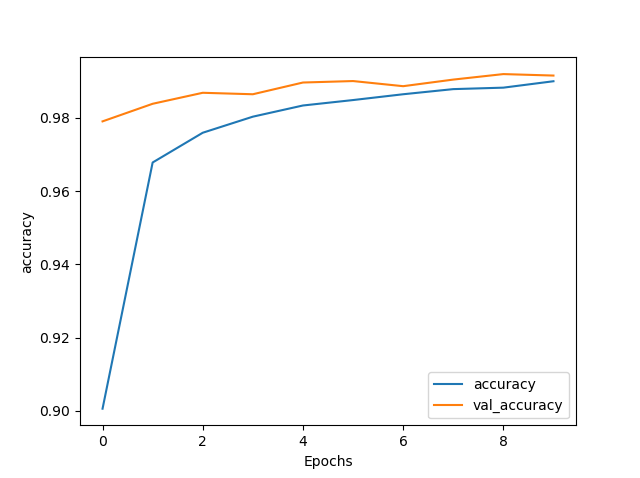
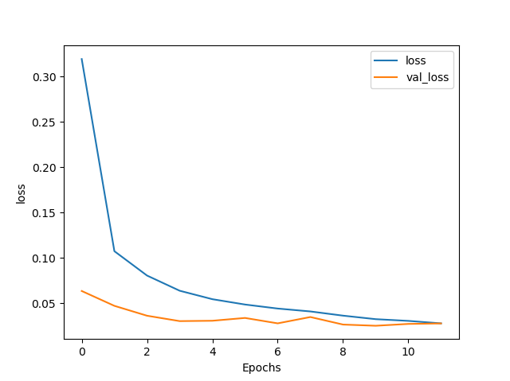

# Image-Classification-using-CNN
Classification of the handwritten digits (0-9) has been performed using CNN. The data set includes 60,000 training samples and 10,000 testing samples. The dataset is collected from MNIST.

• Tensorflow 2.0 is used. 
• 99% accuracy is achieved. 

# Performance

# How to run
check classify_image.py 
